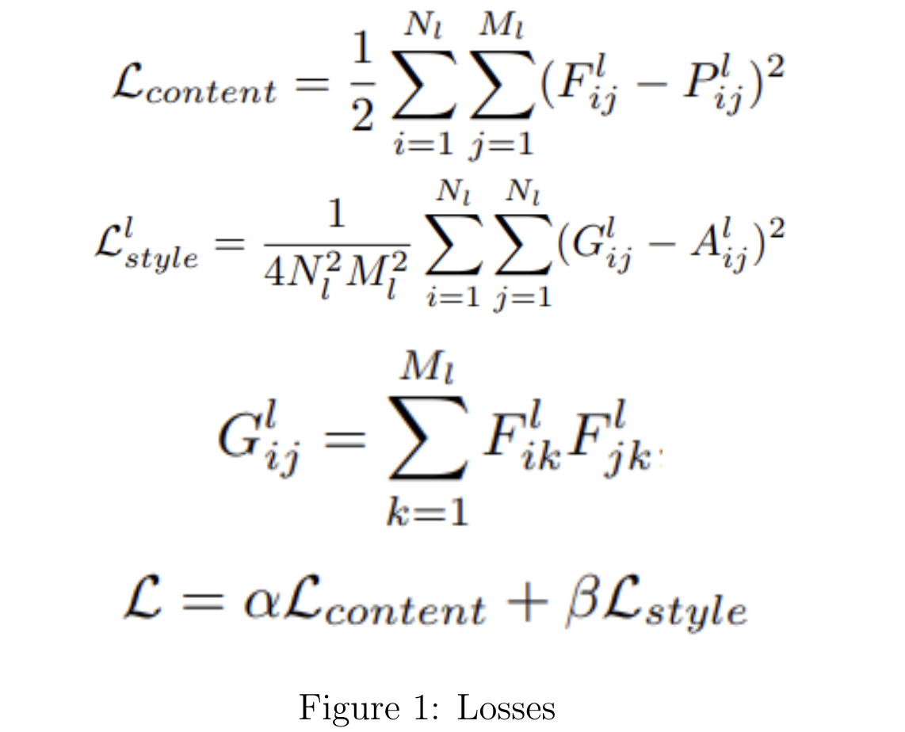
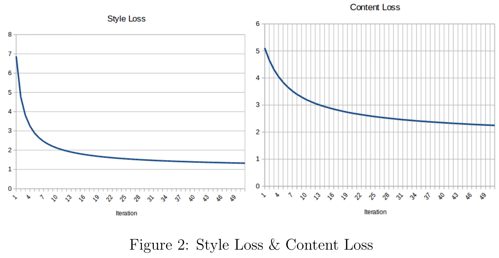
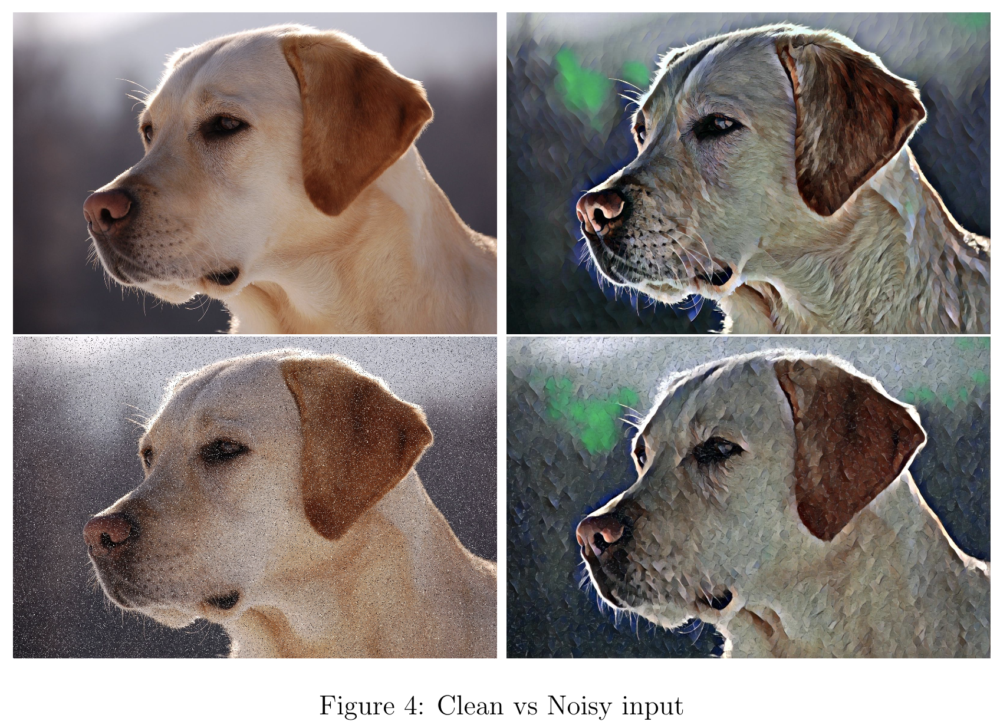
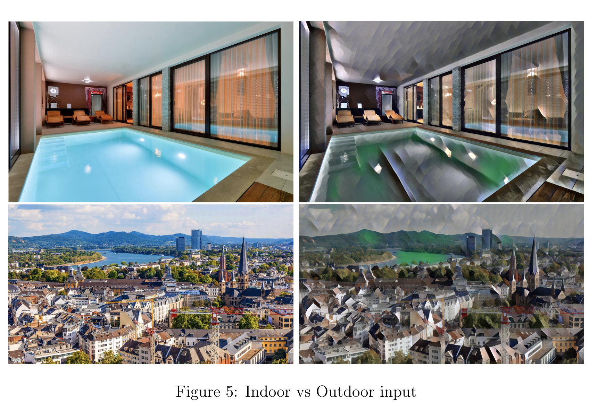

# NeuralStyleTransfer
This project was an assignment for the course "Advance Deep Learning for Computer Graphics" at University of Bonn, Summer Semester 2020

###### Requirement :
1. PyTorch
2. TorchVision
3. Numpy
4. Scipy

###### How to Run :
1. Training:

python neural_style/neural_style.py train --dataset </path/to/train-dataset> --style-image </path/to/style/image> --save-model-dir </path/to/save-model/folder> --epochs 2 --cuda 1

2. Evaluation on an Image

python neural_style/neural_style.py eval --content-image </path/to/content/image> --model </path/to/saved/model> --output-image </path/to/output/image> --cuda 0

###### Parameters Usage
1. epochs - # of epochs to train (2 is more than enough)
2. cuda - 0 for cpu, 1 for gpu usage 

###### Download data for training
Path to download data :  http://mscoco.org/dataset/#download. (13 Gb)

## Loss Functions

  

## Style Loss & Content Loss while training

  

## Evolution of content image while training

  

## Effect of noise in content image

  

## Effect of clustered and indoor content image

  

